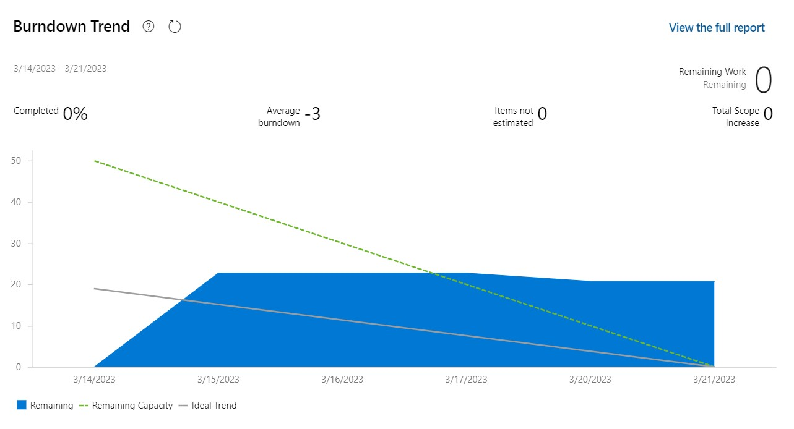
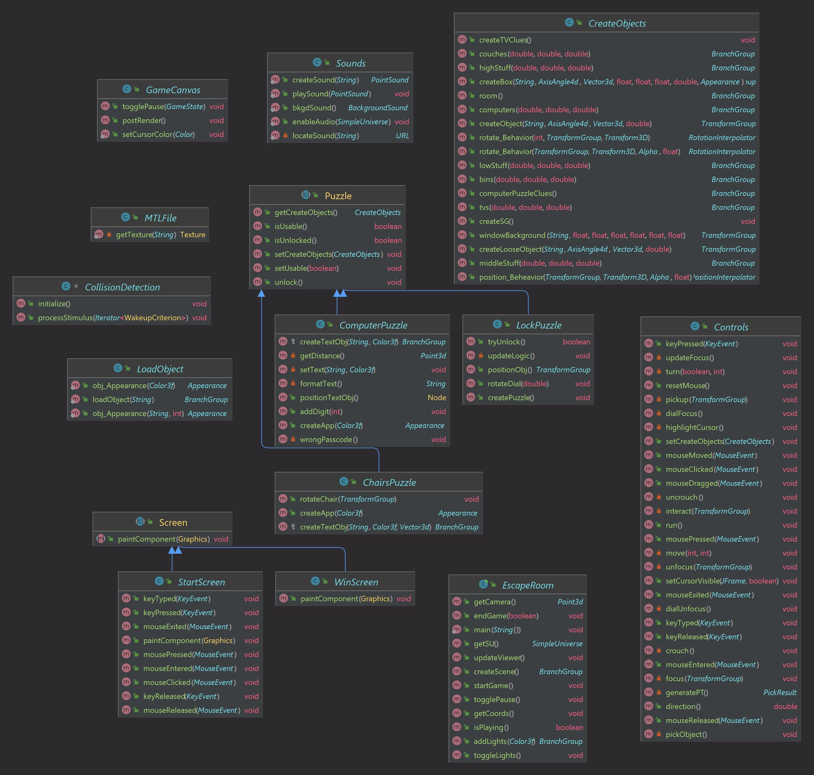

# COMP 2800 Group Project Report

#### ***Authors:** Laila Albalkhi, Ryan Hermes, Tanzim Hossain, Yousef Kart, Borhan Saflo*
#### ***Date:** April 8th 2023*

In submitting this team project and report, I confirm that my conduct during this project adheres to the Student Code of Conduct. I confirm that I did NOT act in such a way that would constitute cheating, misrepresentation, or unfairness, including but not limited to, using unauthorized aids and assistance, personating another person, and committing plagiarism.

## **1. Introduction**

### **1.1 Purpose of the project**
When we first set out to create a Java3D project as a group, we initially considered a variety of options. We explored designs for a racing game, a shooting game, and even an implementation of Flappy Bird. We were looking for something that would prioritize user interaction, complete with a detailed and realistic interface. Ultimately, we decided that a virtual escape room would be the perfect opportunity to meet our requirements. With that, Escape Java was born.

The purpose of our Escape Java project was threefold. First, we wanted to create a project to showcase our understanding of object-oriented software development in the scope of Java3D. Second, we wanted to demonstrate our mastery of the Scrum framework and adoption of the Agile development methodology. Third, we wanted to provide an interactive and engaging experience for our audience.

Escape Java was a great opportunity for us to develop our software development skills and apply the knowledge we gained in the labs and assignments throughout our course to a creative endeavour of our own. Escape Java was a direct application of our understanding of animated objects, digital sensory features, and virtual spaces. We'll go more in depth about our software development process in Section 3 of this report. 

Another purpose of this project to use the Agile methodology, particularly the Scrum framework, to complete our tasks efficiently and effectively. Our project demonstrates our ability to work collaboratively as a team, collectively contributing our individual skillset and expertise to accomplish a common goal. 

As proven by the voting results in the last week of class, our project was engaging and interactive. We chose to model our virtual space on the Java Lounge, a frequented room in Erie Hall, to incorporate an element of realism into our digital project. The audience was quick to recognize a familiar setting, increasing the level of engagement in the virtual world we created. 

### **1.2 Issues to be discussed and their significance**

The first step of modelling the Java Lounge posed a significant problem. Since we were using a real-life room as reference, we had very little margin for error and were required to pay a lot of attention to detail. We initially tried to scan the room as a whole using a mobile application to scan 3D objects. This presented a new issue: The scan we took morphed the objects of the room into one singular object, hindering our ability to interact with individual pieces and position them. We ultimately decided to model each object of the room separately and position them individually. While this approach took more time and sometimes four decimal points of transition coordinates, it resulted in a life-like representation of the Java Lounge.

Navigation around the room was another issue. We faced a problem of defining the camera's path while simultaneously allowing the user to look around at their surroundings. Since one of our key priorities for the project was user engagement, it was crucial to emphasize the user's perspective. This is why we placed the viewing capabilities and mechanisms in the control of the user themselves. The multiple views are defined by their navigation around the room, being able to turn around, crouch, and even elevate to search the room from a bird's eye view.

We also faced some issues with using the Scrum methodology regularly and consistently. As a group of full-time undergraduate students with a number of other commitments, it was difficult to commit to the number of hours specified in our capacity every day. Our capacity realistically fluctuated, increasing some days and decreasing others. This created some issues in our burndown chart, which we will discuss in greater detail in Section 2.

### **1.3 Project methods**

We used a number of techniques, processes, and tools to manage and execute Escape Java. In the context of our project, we primarily used Agile development, version control, continuous integration and delivery, test-driven development, and pair programming.

Adopting the Agile development methodology was the crux of our project and defined the foundation of what we would eventually build. The essential implementation of the Agile methodology was breaking our project into smaller tasks. We used the Agile manifesto as reference, prioritizing early and continuous delivery of software, welcoming changing requirements, and delivering working software frequently. We used Scrum specifically to manage our project, helping us prioritize tasks, set goals, and iterate on our development process based on feedback from our team. 

As a team of 5 working together, version control was an imperative component of our work together. We used Git as our version control system to keep track of changes to our codebase. Git helped us maintain multiple versions of our code, collaborate on code changes, and quickly revert to previous versions if necessary. We worked on multiple branches to minimize conflicts and used detailed commit messages to document our iterative changes to the overall project.

Test-driven development was another key component of the development of Escape Java. When we identified a new use case or story to implement, we defined the test cases that would indicate a successful completion of that task and then developed the code to pass those tests. We translated the requirement of the feature into a unit or integration test, and then wrote and implemented the code to fulfill that requirement. Through test-driven development, we were able to innovate faster and reduce unnecessary implementations by only creating enough code to pass the test.

We met online to work on the project together, and, in many situations, we participated in pair-programming in smaller groups. One person would share the code they were implementing as the on-lookers provided feedback. We used this method during critical stages of the project to ensure that complex parts of the code were developed in a collaborative fashion. This ultimately helped us reduce errors, improve code quality, and increase the group's collective understanding of the code.

### **1.4 Limitations and assumptions**

The main limitations of our project were those that Java3D presented. As a fairly outdated library, we didn't have an adequate amount of resources or documentation to support us through the development of our project. Additionally, there were a few restrictions when it came to importing objects from Blender. We faced some difficulty in directly attaching an object's texture file from Blender. This motivated the creation of our MTL parser, which takes a material file as input and applies it to its respective 3D object within Java3D.

In terms of creative endeavours, we were limited by the realistic virtualization of our project. We had to comply with the physical blueprint of the Java Lounge itself to maintain its referential integrity and representation. This meant that the puzzles we incorporated into the project were required to be those that complimented the physical space; we included colored boxes, clues on the TV screens, and interaction with the high chairs.

## **2. Project Management with Scrum**

### **2.1 Use cases as backlog items**

After the modelling of the room was complete, the first use cases were related to the user's navigation and interaction around the room. These use cases became backlog items for the game features. This included use cases like:
- Move: The user moves around the room, moving the camera as well.
- Crouch: The user crouches down, lowering the camera's view.
- Hover: The user hovers above their position, getting a bird's eye view.
- Inspect: The user clicks on an object to inspect it, zooming it into view.
- Collide: The user collides with an object, unable to move through it.

Then, we started to implement puzzles and clues around the room to increase the user's level of engagement and interaction with their surrounding virtual environment. The use cases transformed into tasks that implemented the logic of the puzzles. This included:
- Input code: The user inputs a numeric code into the computer.
- Turn chair: The user presses 'E' to turn the chair to face a certain direction.
- Rotate lock wheel: The user uses the mouse to rotate the lock to find the correct combination.

### **2.2 Creation of tasks**

At the start of each sprint, we dedicated a meeting to identifying and assigning the tasks of the upcoming week to everyone on our team. We made a list of the tasks we aimed to complete based on the above use cases and assigned them based on everyone's capacity for that week and their projected availability. Due to the intertwined nature of a lot of our features, each backlog item had a set of tasks associated with it. Typically, we aimed to assign specific items to a group member who was skilled or interested in that task. 

To embody the Scrum methodology, our expectations and tasks changed iteratively and continuously as our project progressed. We realized that there were many items we ideally would have liked to complete but needed to be cut due to the time constraints we had. Our main goal was to ensure that at any point in time of our project, the user would experience complete functionality and experience no bugs. The puzzles were added incrementally, one after the other. Here are a few screenshots to show some of the tasks and backlog items we created.

We used the INVEST criteria to create well-defined tasks and Product Backlog Items (PBIs) that met the following criteria:
- **Independent:** The PBI is self-contained and is not reliant on other PBIs.
- **Negotiable:** The PBI is not an explicit contract and leaves space for discussion. The 'What' and 'Why' of the task is described, but not the 'How'.
- **Valuable:** The PBI must deliver value to the stakeholders.
- **Estimable:** The size of the PBI must be estimable to become part of the iteration. If it is not estimable, it should be split.
- **Small:** The PBI is not too big such that it is impossible to plan and prioritize with a level of accuracy, small enough to complete in a Sprint.
- **Testable:** The PBI's description provides the necessary information for development testing. Acceptance criterion can be written immediately.

### **2.3 Planning and Carrying out the Sprint**

Our sprints were each a week long, our first one starting the week after reading week. Our first sprint was heavily focused on the research and requirements gathering portion of the project and spread out evenly among all team members. Borhan, our Scrum master, continuously and regularly monitored the sprints to ensure we were on track, adjusting tasks and our capacities as needed. By default, our sprints were set for only weekdays. We recognized later that this was not representative of our work done, as a lot of us used our weekends to work on the project. We ended up having 4 complete sprint cycles.

We carried out the Sprints on the basis of the three roles in Scrum: Scrum Master (Borhan), Product Owner (XY), and Development Team (all). Borhan was in charge of ensuring that our board was on track, our requirements were given by XY, and everyone on our team implemented the features as the development team.

The above are screenshots from our burndown charts for each sprint. Evidently, in the first screenshot, our understanding of the implementation of the Agile methodology through Scrum practices was still developing. We did not add our capacity and added tasks mid-sprint without an accurate estimate of the time they would take to complete. By the last burndown chart, we were more comfortable with Scrum, and the slope of the graph began to decline. It's worth mentioning that there were a few instances where we had unfinished tasks at the end of our sprint. This was because there were a lot of added features we wished to implement but couldn't due to the lack of time. 

### **2.4 Team management**

To ensure regular communication, we created a Discord group chat to organize synchronous meetings and to hold asynchronous discussions. We met for 15 minutes every night to discuss our individual progress and make any team-wide decisions that would affect the entirety of the project. 

To manage our team effectively, we made sure to enforce clear roles and responsibilities. We worked together to share ideas and give each other feedback on the code we implemented. We also made sure to celebrate our successes to keep team morale high. This fell in line with the Scrum methodology as it encourages a culture of continuous improvement. We were able to optimize our work and deliver a high-quality project by regularly evaluating our processes and identifying areas for improvement.

## **3. (Object-Oriented) Software Development**
### **3.1 Identification of classes**
We have the following classes for our project:
- **ChairsPuzzle**: contains the logic for the rotating chairs puzzle.
- **CollisionDetection**: handles and detects any collision during user navigation and interaction.
- **ComputerPuzzle**: contains the logic for the passcode puzzle on the computer.
- **Controls**: handles the details of the user navigation and their ability to interact with the virtual space.
- **CreateObjects**: creates and renders all the objects that appear in the room.
- **EscapeRoom**: launches the virtual escape room experience.
- **GameCanvas**: creates the canvas for the game.
- **LoadObject**: loads each object from its corresponding 3D model.
- **LockPuzzle**: contains the logic for the lock combination puzzle on the safe.
- **MTLFile**: parses material files to add textures.
- **Sounds**: incorporates both background music and sound effects to the game.
- **StartScreen**: loads the start screen at the beginning of the game.
- **WinScreen**: displays a success message at the end of the game upon escape.

### **3.2 Software design with class diagram(s)**

See attached class diagram image for more details.

### **3.3 Techniques of implementation**

We used abstraction to simplify the design of our game and make it more manageable. This helped us create simple and reusable objects that could be easily integrated into the game, including the chairs and tables that were regularly repeated around the room. We also used polymorphism to create objects that could behave differently based on their context. This enabled us to create a more dynamic and flexible game with objects that could adapt to different situations, including the clues that the user was able to interact with.

We used polymorphism to create objects that take on multiple forms, especially to create visual differences (size, height, texture) between them. This was extremely useful and effective when creating multiple objects that were very similar but shared slight differences. This was used to create the colored cubes around the room and the furniture that was positioned.

In hindsight, there were a lot more object-oriented software development practices and design patterns we could have incorporated and implemented into our project. Encapsulation would have been helpful to hide the internal details of an object to only expose the public interface to others, like the clues that were hidden around the room. Inheritance could have been implemented for the creation of each puzzle since they shared a lot of the same characteristics and had the same user interaction. 

### **3.4 Software testing and operation**

We used a combination of unit-testing, integration testing, and acceptance testing to ensure that our project was progressing on the right track and meeting the specified requirements. 

Using unit tests helped us catch errors early in the development process and ensure that the individual components of the game were functioning correctly. Our unit tests made sure that any added feature did not jeopardize the integrity of our other implemented features.

Integration testing was important to test how the various components worked together as a system, such as the game engine, the user interface, and the puzzle logic. Integration testing caught any errors that were missed by our unit tests.

We also implemented a variety of acceptance tests to validate the requirements of our end-users. We were able to gather feedback from our personal experiences with the game and adjust our implementation accordingly.

Throughout our testing process, the most important thing was to regularly monitor and log our progress. Any failed or fixed tests were documented and used as references when a new bug appeared. This was crucial in making sure that the performance of our game was monitored, giving us the opportunity to proactively identify and resolve issues and ensure that the game remained performant for users.

## **4. Discussions and Recommendations**
### **4.1 Discussions about the team projects**

The team project was a testament to our ability to work in a group to accomplish a common goal. The skills we learned by working on a team are skills that we can later directly apply to our jobs in the tech industry, especially as software engineers. Alone, we would not have been able to complete the project within the given time frame. It was only by working as a team that we were able to pool our resources, skills, and shared experiences to come up with an impressive result.

Within our own team, we had many discussions and open conversations. We discussed the scope of the project to clearly define the boundaries we would work within. We discussed how to approach the logic of each puzzle as we implemented it, and even discussed how we should manage ourselves using Scrum. The Scrum framework was crucial in ensuring that we were getting work done in an efficient and effective manner, and it was a visual representation of our progress as we approached our deadlines.

### **4.2 Recommendations for better practices**

If we were to do this group project again, we probably would have started earlier. Although we were instructed to start after reading week, it would have been beneficial to get a head start on these process and the understanding of Scrum and the Agile methodology beforehand.

It would have also helped us to clearly define our roles at the beginning of the project. We started to identify roles as tasks came up to be able to accurately identify everyone's strengths and weaknesses, but it may have saved us some time and conflict to clearly define them earlier.

## **Appendix A: Feature Descriptions**

- F1: Java Lounge Model
- F2: Pick up objects
- F3: Focus on objects
- F4: Computer Puzzle
- F5: Chair Puzzle
- F6: Lock Puzzle
- F7: Computer Puzzle Clues
- F8: Chair Puzzle Clues
- F9: Lock Puzzle Clues
- F10: Background sounds
- F11: Room lights
- F12: Navigating the room

| | F1 | F2 | F3 | F4 | F5 | F6 | F7 | F8 | F9 | F10 | F11 | F12 |
| --- | --- | --- | --- | --- | --- | --- | --- | --- | --- | --- | --- | --- |
| Background | X | | | | | | | | | | | X
| Sound(s) | | | | X | X | X | | | | X | | X
| Light(s) |  | | | | | | | | | | X | X
| 3D objects (texture mapping) | X | | | | X | X | | | | | |
| 3D objects (shape changes) | X | | | | | | | | | | |
| Animation (pre-defined) | X | X | | | | | | | | | | 
| Self-defined behaviour | | | | X | X | X | | | | | | X
| Collision detection | X | X | | X | X | X | X | | | | | X
| Mouse picking | | X | | X | X |  | X | X | X | | |
| LOD | | X | X | | | X | | | | | | X
| Navigation | X | | | X | X | | X | X | X | | | X 
| Multi-view | | X | X | | X | | X | X | X | | | X

## **Appendix B: Contribution Table**

| Backlog Item Title | Task Title | Borhan | Laila | Tanzim | Ryan | Yousef |
| ----- | ----- |--------| ----- |--------|----|--------|
| Cross Hair | Cross Hair  | 10     | |        |    |        |
| Game States | Game States | 10     | |        |    |        |
| | Paused Screen | 5      | |        | 5  |        |
| | Start Screen | 10     | |        |    |        |
| Model Room | Model Couches |        | | 10     |    |        |
| | Model Computer Chairs |        | | 10     |    |        |
| | Model High Tables |        | | 10     |    |        |
| | Model High Chairs |        | | 10     |    |        |
| | Model Middle Tables |        | | 10     |    |        |
| | Model Middle Chairs |        | | 10     |    |        |
| | Model Recycling Bins |        | |        |    | 10     |
| | Model Trash Bin |        | |        |    | 10     |
| | Model Clock |        | |        |    | 10     |
| | Model Window |        | |        |    | 10     |
| | Model Computer |        | |        |    | 10     |
| | Model Computer Desks |        | |        |    | 10     |
| | Model TVs |        | |        |    | 10     |
| | Model Whiteboard |        | |        |    | 10     |
| | Model Door |        | |        |    | 10     |
| | Model Ottoman |        | | 10     |    |        |
| | Model Lights |        | |        |    | 10     |
| | Model Fan |        | | 10     |    |        |
| Positioning Objects | Positioning Couch |        |10 |        |    |        |
| | Positioning High Chairs |        | 10 |        |    |        |
| | Positioning Low Chairs |        | 10|        |    |        |
| | Positioning Low Tables |        |10 |        |    |        |
| | Positioning Middle Chairs |        | |        | 10 |        |
| | Positioning Middle Tables |        | |        | 10 |        |
| | Positioning Safe |        |10|        |    |        |
| Model Textures | Wooden Texture |        | | 5      |    | 5      |
| | Floor Texture |        | | 5      |    | 5      |
| | Wall Texture |        | | 5      |    | 5      |
| | Couch Texture |        | | 5      |    | 5      |
| | Ceiling Texture |        | | 5      |    | 5      |
| Collision Detection | Develop Collision Detection |        | | 10     |    |        |
| | Implement Wall Collision |        | 3| 2      | 3  | 2      |
| | Test Collision Detection | 2      | 2| 2      | 2  | 2      |
| Camera Movement | Develop Keyboard Movement | 4      |3 |        | 3  |        |
| | Develop Mouse Movement | 10     | |        |    |        |
| | Test Mouse Movement |        |7 |        | 3  |        |
| Object Interaction | Focus Object |        | |        | 3  | 7      |
| | Unfocus Object |        | |        | 3  | 7      |
| | Object Highlighting | 2      | 2| 2      | 2  | 2      |
| Refactor Code | Create SharedGroups |        | |        | 10 |        |
| | Optimize object rendering |        | |        | 10 |        |
| Sounds | Background Music | 10     | |        |    |        |
| | Success Sound Effect | 10     | |        |    |        |
| | Failure Sound Effect | 10     | |        |    |        |
| Computer Puzzle | Design User Interface | 5      | 5|        |    |        |
| | Implement Numpad Logic | 9      | 1|        |    |        |
| | Hide Clues |        | 10|        |    |        |
| | Display Numbers | 10     | |        |    |        |
| | Reset Numbers For Wrong Passcode | 8      |1 |        | 1  |        |
| | Incorporate Sound To Interaction | 10     | |        |    |        |
| Chairs Puzzle | Make Chairs Interactable | 4      | | 3      |    | 3      |
| | Rotate Chair |        | |        | 3  | 7      |
| | Add TV Clues | 10     | |        |    |        |
| | Add Colored Chairs |        | |        |    | 10     |
| | Implement Puzzle Logic | 10     | |        |    |        |
| Lock Puzzle | Implement Combination Logic |        | | 10     |    |        |
| | Open Safe |        | | 10     |    |        |
| | Add Key |        | | 8      |    | 2      |
| Animations | Door Knob |        | 3|        |   | 7      |
| | Door |        | 1|        | 8  | 1      |
| | Chair |        |1 |        | 8  | 1      |
| | Safe |        | | 10     |    |        |

## **Appendix C: Participation Table**

*Note: all durations are in minutes.*

| Meeting Date | Duration | Borhan | Laila | Tanzim | Ryan | Yousef |
| ----- | ----- | ----- | ----- | ----- | ----- | ----- |
| 27.Feb.2023 | 30 | 30 | 30 | 30 | 30 | 30 |
| 01.Mar.2023 | 30 | 30 | 30 | 30 | 30 | 30 |
| 02.Mar.2023 | 15 | 15 | 15 | 15 | 15 | 15 |
| 03.Mar.2023 | 15 | 15 | 15 | 15 | 15 | 15 |
| 06.Mar.2023 | 15 | 15 | 15 | 15 | 15 | 15 |
| 07.Mar.2023 | 15 | 15 | 15 | 15 | 15 | 15 |
| 08.Mar.2023 | 15 | 15 | 15 | 15 | 15 | 15 |
| 09.Mar.2023 | 15 | 15 | 15 | 15 | 15 | 15 |
| 10.Mar.2023 | 15 | 15 | 15 | 15 | 15 | 15 |
| 11.Mar.2023 | 45 | 45 | 45 | 45 | 45 | 45 |
| 13.Mar.2023 | 15 | 15 | 15 | 15 | 15 | 15 |
| 14.Mar.2023 | 15 | 15 | 15 | 15 | 15 | 15 |
| 15.Mar.2023 | 15 | 15 | 15 | 15 | 15 | 15 |
| 16.Mar.2023 | 15 | 15 | 15 | 15 | 15 | 15 |
| 21.Mar.2034 | 45 | 45 | 45 | 45 | 45 | 45 |
| 22.Mar.2023 | 15 | 15 | 15 | 15 | 15 | 15 |
| 23.Mar.2023 | 10 | 10 | 10 | 10 | 10 | 10 |
| 24.Mar.2023 | 10 | 10 | 10 | 10 | 10 | 10 |
| 25.Mar.2023 | 60 | 60 | 60 | 60 | 60 | 60 |
| 26.Mar.2023 | 120 | 120 | 120 | 120 | 120 | 120 |
| 27.Mar.2023 | 15 | 15 | 15 | 15 | 15 | 15 |
| 28.Mar.2023 | 15 | 15 | 15 | 15 | 15 | 15 |
| 29.Mar.2023 | 10 | 10 | 10 | 10 | 10 | 10 |
| 01.Apr.2023 | 30 | 30 | 30 | 30 | 30 | 30 |
| 02.Apr.2023 | 30 | 30 | 30 | 30 | 30 | 30 |
| 03.Apr.2023 | 30 | 30 | 30 | 30 | 30 | 30 |
| 04.Apr.2023 | 10 | 10 | 10 | 10 | 10 | 10 |
| 05.Apr.2023 | 10 | 10 | 10 | 10 | 10 | 10 |
| 08.Apr.2023 | 10 | 10 | 10 | 10 | 10 | 10 |
| **Total** | 690 | 690 | 690 | 690 | 690 | 690 |

